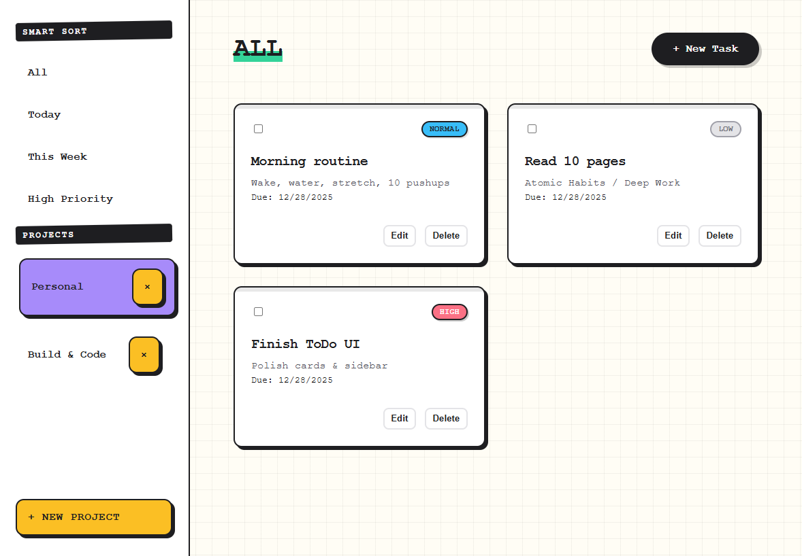

# ToDo

A multi-project task manager built with vanilla JavaScript and Webpack.

This app supports persistent storage, smart filtering, modal-based task management, and a retro-styled interface.



## Features

- Multiple projects
- LocalStorage persistence
- Smart filters: Today, This Week, High Priority, All
- Modal-based task creation & editing
- Delete tasks and projects
- Retro UI
- Built with vanilla JavaScript and Webpack

## Tech Stack

- JavaScript (ES Modules)
- Webpack
- LocalStorage
- CSS Grid & Flexbox

## Setup

```bash
git clone https://github.com/NyxLumen/Todo.git
cd todo
npm install
npm start
```
